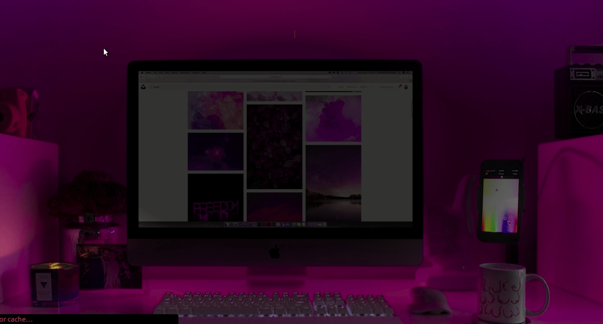

 

  

  <h3 align="center">Potfolio</h3>

  

    React Project
     
     
    <a href="#">View Demo</a>
    ·
    <a href="https://github.com/wathigo/Portfolio/issues">Report Bug</a>
    ·
    <a href="https://github.com/wathigo/Portfolio/issues">Request Feature</a>
  

<!-- TABLE OF CONTENTS -->
## Table of Contents

* [About the Project](#about-the-project)
  * [Built With](#built-with)
* [Contact](#Contact)

<!-- ABOUT THE PROJECT -->
## About The Project

  

A simple react project for my portfolio
It shows good understanding of react hooks and functional components.

### Built With
* [React](https://reactjs.org/)

### Contact

* [Simon Wathigo](https://github.com/wathigo) - wathigosimon@gmail.com - [Linkedin](https://www.linkedin.com/in/simon-wathigo-445370183/)
